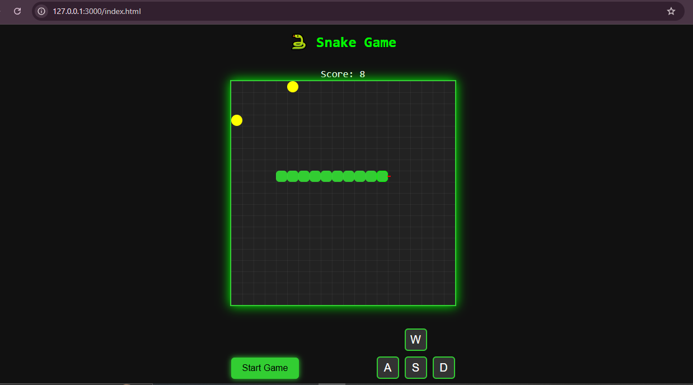

# 🐍 snake-rush

> Classic snake game reborn — with sound, speed, and nostalgic charm.

[🎮 **Tap here to play**](https://shritij26.github.io/snake-rush/)

## 🎮 Features
- 🎵 Sound effects (start, turn, eat, game over)
- 🕹️ WASD / Arrow key + on-screen controls
- 🌑 Dark retro theme
- 💀 Game over screen with final score
- 👅 Snake has a tiny red tongue (style!)

## 🚀 How to Play
Slither through the grid, eat to grow, and avoid crashing.  
Keep your reflexes sharp — it gets fast real quick!

## 💻 Tech Stack
HTML, CSS, JavaScript (vanilla)

---

> ⚡ Built for fun, fueled by nostalgia.  
> 🧩 Simple code, smooth play, endless replay.

---
